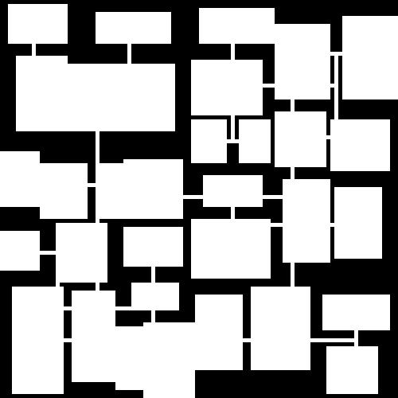
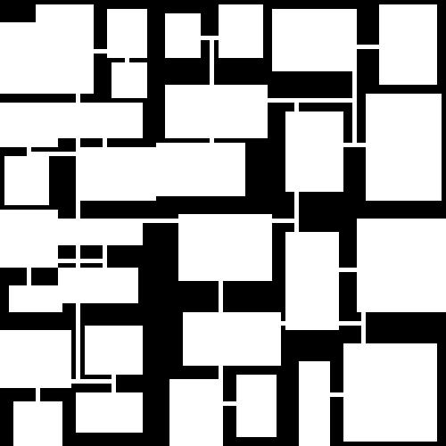
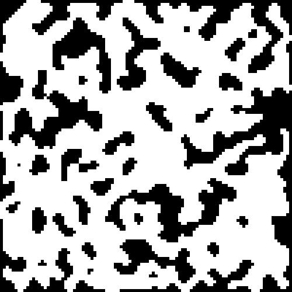

# Map Generator

## Methods

### BSP Tree

```shell
# output map in terminal
go run main.go bsp -H 100 -W 100 --depth 6
# output map as jpeg
go run main.go bsp -H 100 -W 100 --depth 6 -o examples/bsp.jpeg
# with specific seed
go run main.go bsp -H 100 -W 100 --seed 1 --depth 6 -o examples/bsp-1.jpeg
```

**examples:**






### Cellular Automata

```shell
go run main.go ca -H 100 -W 100 --iter 5 --density 55 --seed 10 -o examples/ca.jpeg
# exclude island of which area under <min-area> 
go run main.go ca -H 100 -W 100 --iter 5 --density 55 --seed 10 --min-area 10 -o examples/ca-1.jpeg
```

**examples:**

without `--min-area`:


with `--min-area`:


